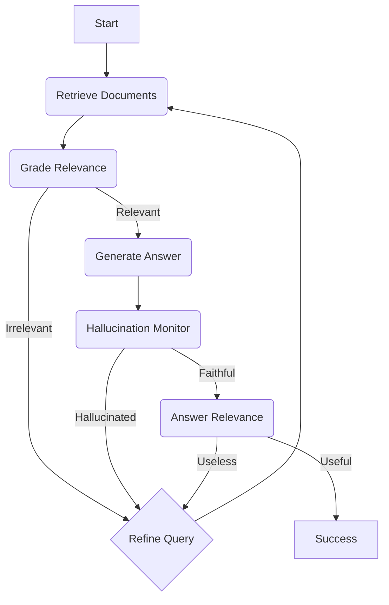

# Agentic Reasoning Engine

[](https://www.python.org/downloads/)
[](https://langchain-ai.github.io/langgraph/)
[](LICENSE)

An autonomous, self-correcting RAG system utilizing graph-based state machines for multi-step research and groundedness verification.

This engine operates as a cognitive agent: it verifies outputs against source facts, refines search queries based on relevance scores, and manages routing between internal vector stores (Qdrant) and external research (DuckDuckGo).

## Architectural Overview

The core logic is implemented via LangGraph, orchestrating a cyclic state machine to enable self-healing reasoning paths.



### Components
1.  **Intent Routing**: Claude Opus3.5 classifies user intent to select the optimal retrieval path.
2.  **Stateful Feedback**: Cyclic graph topology allows the agent to re-research and re-generate if the initial output fails groundedness or relevance checks.
3.  **Observability**: Integrated Langfuse tracing for node-level latency analysis and execution auditing.

## Performance Engineering

Verification tasks are offloaded from cloud APIs to a specialized local inference layer.

*   **Latency Profile**: Local ModernBERT guardrail reduces verification latency to <15ms (GPU) or <400ms (CPU), compared to typical 10s API round-trips.
*   **Optimization**: Implemented 4-bit NormalFloat (NF4) quantization and Flash Attention 2 for efficient local deployment.
*   **Hybrid Logic**: High-availability fallback configuration. If local confidence falls below 0.7, the system triggers a Gemini 2.5 Flash API call for deep verification.
*   **Throughput**: Theoretical capacity of ~2.5M local checks per day on single-node GPU hardware at zero marginal compute cost.

## Capabilities

Architectural patterns implemented for production-grade RAG:

*   **P95 Optimization**: Significant reduction in end-to-end latency by localizing binary classification tasks.
*   **Resiliency**: Redundant grading layers through local/cloud hybrid telemetry.
*   **Data Privacy**: Optional on-premise compliance checking against sensitive internal documentation.

## Directory Structure

```bash
├── frontend/             # React + Vite + Tailwind UI
├── src/                  # Core Agent Logic
│   ├── graph/            # LangGraph State Machine
│   │   ├── nodes/        # Individual Agent Nodes
│   │   ├── state.py      # State Schema
│   │   └── workflow.py   # Workflow Configuration
│   ├── main.py           # FastAPI Entrypoint
│   └── vectorstore.py    # Qdrant Integration
├── docker-compose.yml    # Infrastructure Configuration
└── requirements.txt      # Dependency Specification
```

## Installation

Requires Python 3.12+, Node.js 20+, and Docker.

```bash
git clone https://github.com/AbeneilMagpantay/Agentic-Reasoning-Engine.git
cd Agentic-Reasoning-Engine

# 1. Install Backend Dependencies
pip install -r requirements.txt

# 2. Install Frontend Dependencies
cd frontend
npm install
cd ..
```

## Configuration

Configure environment variables in a `.env` file:

```ini
GOOGLE_API_KEY=your_gemini_key
QDRANT_URL=http://localhost:6333
LANGFUSE_PUBLIC_KEY=pk-lf-...
LANGFUSE_SECRET_KEY=sk-lf-...
LANGFUSE_HOST=https://cloud.langfuse.com
```

## Usage

1.  **Infrastructure**: `docker-compose up -d`
2.  **Backend**: `uvicorn src.main:app --port 8000`
3.  **Frontend**: `cd frontend && npm run dev`

## Disclaimer

This project is a technical implementation of agentic patterns. Output verification remains necessary for critical applications.
